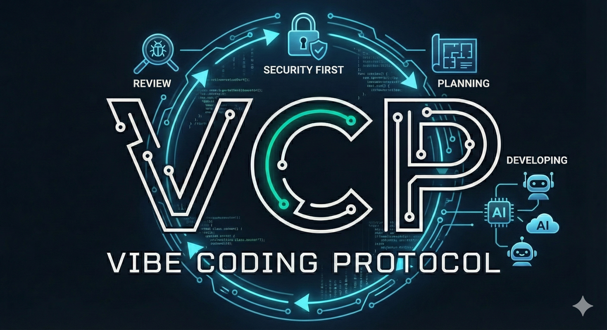

<p align="right"><a href="https://github.com/Z-M-Huang/vcp/wiki/Home.zh">中文文档</a></p>

<div align="center">



# VCP — Vibe Coding Protocol

**The security gate for AI-generated code.**


</div>

Other tools scan code *after* your AI writes it. VCP prevents bad code *before* it reaches disk — injecting 100+ rules into the AI's context, blocking dangerous patterns in real time, and providing deep analysis on demand.

```
❌ VCP Security Gate — BLOCKED:
   CWE-798: Hardcoded secret detected. Use environment variables or a secret manager.
```

---

## Table of Contents

- [Quick Start](#quick-start)
- [Two Plugins, One Protocol](#two-plugins-one-protocol)
- [Why This Matters](#why-this-matters)
- [VCP — Three-Layer Enforcement](#vcp--three-layer-enforcement)
- [Dev Buddy — Multi-AI Pipeline](#dev-buddy--multi-ai-pipeline)
- [Standards Coverage](#standards-coverage)
- [Organization-Wide Standards](#organization-wide-standards)
- [Configuration](#configuration)
- [Core Philosophy](#core-philosophy)
- [Documentation](#documentation)
- [How to Contribute](#how-to-contribute)
- [Repo Structure](#repo-structure)
- [References](#references)
- [License](#license)

---

## Quick Start

**Prerequisites:** [Claude Code](https://code.claude.com/) and [Bun](https://bun.sh/). See the [Getting Started guide](https://github.com/Z-M-Huang/vcp/wiki/Getting-Started) for full setup.

```bash
# Add the VCP marketplace
/plugin marketplace add Z-M-Huang/vcp

# Install the plugin
/plugin install vcp@vcp

# Initialize your project
/vcp-init
```

That's it. Standards are injected at session start, dangerous patterns are blocked on every write, and 10 scanning skills are available on demand.

### Docker

Prefer a containerized environment? VCP provides a ready-to-use Docker image with Claude Code, Codex CLI, Gemini CLI, and all dependencies pre-installed:

```bash
cd docker/
cp .env.example .env
# Edit .env with your API keys and host paths
docker compose up -d
docker exec -it vcp-docker bash
```

See [`docker/README.md`](docker/README.md) for full setup instructions, volume mounts, and platform-specific configuration.

---

## Two Plugins, One Protocol

VCP ships two complementary plugins:

| Plugin | What It Does | Install |
|--------|-------------|---------|
| **VCP** | Standards enforcement — 41 standards, real-time blocking, 10 skills | `/plugin install vcp@vcp` |
| **Dev Buddy** | Multi-AI pipeline — configurable stages, cross-model review gates, 7 specialist agents | `/plugin install vcp@dev-buddy` |

Use VCP alone for standards enforcement. Add Dev Buddy when you want structured multi-AI workflows with cross-model review.

---

## Why This Matters

<div align="center">

</div>

AI coding assistants produce code fast. They also produce code that's **2.74x more likely to contain security vulnerabilities**, **40% more complex**, and architecturally unsound at scale:

| Problem | Data | Source |
|---------|------|--------|
| Security vulnerabilities | 2.74x higher rate than human code; 45% of AI code has vulnerabilities | CodeRabbit 2025, Veracode 2025 |
| Code duplication | 8-fold increase across 211M lines analyzed | GitClear 2024 |
| Complexity growth | 40% increase in AI-assisted repositories | CMU 2025 |
| Hallucinated packages | ~20% of recommendations reference non-existent packages | Lasso Security |
| Refactoring collapse | Dropped from 25% to <10% of changed lines | GitClear 2024 |

**The death spiral:** AI generates working code fast. A bug appears. AI patches the symptom, not the root cause. The patch breaks assumptions elsewhere. Each fix compounds the problem — hack on top of hack. The codebase becomes unmaintainable within months.

VCP breaks this cycle by making the AI aware of engineering principles *before* it writes code, not after.

---

## VCP — Three-Layer Enforcement

<div align="center">

</div>

No single layer catches everything. Layer 1 prevents violations at the source. Layer 3 blocks the most dangerous patterns instantly. Layer 2 catches the nuanced issues through deep analysis. Together they provide defense in depth.

### Layer 1: Proactive Context — Prevent Before Writing

At session start, VCP injects a compact summary of all applicable rules into the AI's context. The AI internalizes security, architecture, testing, and quality rules *while it writes code* — preventing violations at the source.

Run `/vcp-context` to re-inject rules at any time (useful after context compaction in long sessions).

### Layer 2: On-Demand Scanning — Deep Analysis

Skills scan code against 41 standards across 12 scopes using AI-driven analysis:

| Skill | What It Does |
|-------|-------------|
| `/vcp-audit` | Full audit against all applicable standards — security, architecture, quality, compliance |
| `/vcp-pre-commit-review` | Reviews all changed files before commit, produces PASS/BLOCK verdict |
| `/vcp-dependency-check` | Lockfile hygiene, version ranges, package existence, typosquatting detection |
| `/vcp-review-tests` | Test quality: over-mocking, tautological tests, missing edge cases |
| `/vcp-coverage-gaps` | Maps source to test files, finds untested functions and missing edge cases |
| `/vcp-test-plan` | Generates test plans with unit/integration tests, edge cases, and mock guidance |
| `/vcp-root-cause-check` | Analyzes bug fixes for root cause vs. symptom patching |

### Layer 3: Real-Time Blocking — Stop Dangerous Code Instantly

A security gate hook runs on every `Write`, `Edit`, and `Bash` call, blocking dangerous patterns before they reach disk:

<details>
<summary><strong>21 patterns across 9 CWEs</strong> — click to expand</summary>

| CWE | What It Catches |
|-----|----------------|
| CWE-798 | Hardcoded secrets, AWS keys, private keys, JWT tokens, DB connection strings, Bearer tokens, API key prefixes |
| CWE-89 | SQL injection via string concatenation and template literals |
| CWE-95 | Code injection via `eval()` with user input |
| CWE-79 | XSS via `innerHTML` with variable assignment |
| CWE-502 | Insecure deserialization: pickle, unsafe YAML, node-serialize |
| CWE-643 | XPath injection via string concatenation |
| CWE-1321 | Prototype pollution via `__proto__` or `constructor.prototype` |
| CWE-1336 | Server-side template injection (SSTI): Jinja2, Handlebars with variable input |
| CWE-116 | Encoded data piped to shell execution |

</details>

### Coverage Backed by Industry Standards

VCP standards are mapped against authoritative security frameworks:

- **OWASP Top 10:2025** — All 10 categories covered
- **OWASP Agentic AI Security Top 10 (ASI)** — All 10 categories covered (ASI01–ASI10)
- **CWE Top 25:2024** — 19/25 covered (6 uncovered are memory-safety, out of scope for managed languages)
- **OWASP API Security Top 10:2023** — All 10 categories addressed
- **OWASP ASVS v5.0** — 15/17 chapters covered
- **OWASP Docker Security** — 11/13 controls covered

---

## Dev Buddy — Multi-AI Pipeline

<div align="center">

</div>

One AI writing and reviewing its own code is like grading your own homework. Dev Buddy orchestrates **multiple AI models** through structured development pipelines — with task-based dependencies that literally prevent skipping stages.

### Two Pipelines

| Pipeline | Command | Phases |
|----------|---------|--------|
| **Feature Development** | `/dev-buddy-feature-implement` | Requirements → Planning → Plan Reviews → Implementation → Code Reviews |
| **Bug Fix** | `/dev-buddy-bug-fix` | Root Cause Analysis → Plan Validation → Implementation → Code Reviews |

### Cross-AI Review Gates

Different AI models review each other's work at each phase. A typical pipeline:

```
Claude Opus plans ──→ Claude Sonnet reviews ──→ Claude Opus reviews ──→ Codex reviews
                                                                            │
                      Claude Sonnet implements ◀────────────────────────────┘
                            │
                      Claude Sonnet reviews ──→ Claude Opus reviews ──→ Codex reviews
```

Each review is independent — reviewers don't see each other's verdicts. Cross-model review catches issues that single-AI self-review misses.

### Data-Driven Enforcement

Pipeline stages aren't instructions the AI might skip — they're **task dependencies** enforced by the system:

| Instruction-Based (fragile) | Task-Based (VCP) |
|-----------------------------|-------------------|
| "Run Sonnet → Opus → Codex" | `blockedBy` prevents Codex until Opus completes |
| AI can skip "redundant" steps | `TaskList()` only shows unblocked tasks |
| No audit trail | Complete task history with metadata |
| Hidden progress | Real-time task progress visible to user |

### Team-Based Requirements

The feature pipeline spawns 5 specialist agents that explore your codebase in parallel before a single line of code is planned:

| Specialist | Focus |
|------------|-------|
| Technical Analyst | Existing codebase, patterns, dependencies, files to modify |
| UX/Domain Analyst | User workflows, edge cases, accessibility |
| Security Analyst | Threat model, OWASP relevance, non-functional security requirements |
| Performance Analyst | Load impact, scalability, bottlenecks, caching |
| Architecture Analyst | Design patterns, SOLID principles, maintainability |

Their findings inform requirements gathering — producing richer, more complete specifications from the start.

### Configurable Pipeline

The pipeline is defined in `~/.vcp/dev-buddy.json` as ordered arrays of stages. Each stage specifies a type, provider, and model. Add, remove, or reorder stages. Swap AI providers per stage. Use the web portal (`/dev-buddy-config`) or edit JSON directly.

<details>
<summary><strong>Example: feature pipeline with Codex final gates</strong> — click to expand</summary>

```json
{
  "feature_pipeline": [
    { "type": "requirements", "provider": "anthropic-subscription", "model": "opus" },
    { "type": "planning", "provider": "anthropic-subscription", "model": "opus" },
    { "type": "plan-review", "provider": "anthropic-subscription", "model": "sonnet" },
    { "type": "plan-review", "provider": "anthropic-subscription", "model": "opus" },
    { "type": "plan-review", "provider": "my-codex-preset", "model": "o3" },
    { "type": "implementation", "provider": "anthropic-subscription", "model": "sonnet" },
    { "type": "code-review", "provider": "anthropic-subscription", "model": "sonnet" },
    { "type": "code-review", "provider": "anthropic-subscription", "model": "opus" },
    { "type": "code-review", "provider": "my-codex-preset", "model": "o3" }
  ]
}
```

</details>

### Quick Start

```bash
# Install dev-buddy alongside VCP
/plugin install vcp@dev-buddy

# Feature development pipeline
/dev-buddy-feature-implement Add user authentication with JWT

# Bug fix pipeline
/dev-buddy-bug-fix Login fails when email contains a plus sign

# Configure pipeline stages and providers via web portal
/dev-buddy-config
```

---

## Standards Coverage

41 standards across 12 scopes:

| Scope | Standards | What They Cover |
|-------|-----------|----------------|
| **Core** (always active) | 12 | Security, architecture, root cause analysis, code quality, error handling, testing, dependency management, secure defaults, API misuse prevention, attack surface analysis, data flow security, concurrency security |
| **Web Frontend** | 4 | XSS prevention, CSP, accessibility (WCAG 2.2), performance, component structure |
| **Web Backend** | 6 | Injection prevention, API design, data access, WebSocket/SSE, caching security, backend structure |
| **Database** | 2 | Encryption (TDE, column-level, key management), schema security (RLS, masking, audit) |
| **Mobile** | 2 | Keychain/KeyStore, certificate pinning, deep links, biometrics, attestation, platform configuration |
| **Desktop** | 1 | Electron context isolation, Tauri capabilities, IPC validation, code signing |
| **CLI** | 1 | Shell injection, argument injection, exit codes, signal handling |
| **DevOps** | 4 | Containers, CI/CD, Infrastructure as Code, Kubernetes |
| **Agentic AI** | 5 | Agent security (prompt injection, code execution, memory poisoning), tool security (MCP vetting, allowlists), permissions (least privilege, rogue detection), supply chain (MCP integrity, model provenance), communication (inter-agent auth, cascading failures) — OWASP ASI Top 10 |
| **Compliance — GDPR** | 1 | Data deletion, retention, consent, PII handling |
| **Compliance — PCI DSS** | 1 | Tokenization, card masking, CDE isolation |
| **Compliance — HIPAA** | 1 | PHI encryption, audit logging, retention, minimum necessary |
| **Compliance — Accessibility** | 1 | ADA, Section 508/504, EAA, PSBAR, AODA, ACA, EN 301 549, WCAG conformance mapping, accessibility statements, VPAT/ACR |

All standards follow a consistent format: **WHY** (the principle), **WHAT** (numbered actionable rules), **HOW** (code examples and anti-patterns). See [`standards/README.md`](standards/README.md) for the format specification.

---

## Organization-Wide Standards

VCP's manifest system lets organizations enforce their own rules across all projects and developers — alongside or instead of VCP defaults.

```
Root Manifest (manifest.json)
├── core scope     → https://your-org.github.io/standards/scopes/core.json
│   ├── core-security.md      (VCP default)
│   ├── core-architecture.md  (VCP default)
│   └── org-coding-style.md   (your custom standard)
├── web-backend    → https://your-org.github.io/standards/scopes/web-backend.json
│   ├── web-backend-security.md   (VCP default)
│   └── org-api-conventions.md    (your custom standard)
└── org-internal   → https://your-org.github.io/standards/scopes/org-internal.json
    ├── org-logging-policy.md     (your custom standard)
    └── org-data-classification.md (your custom standard)
```

<details>
<summary><strong>Set up for your organization</strong> — click to expand</summary>

#### 1. Create your standards

Write markdown files following the [VCP format spec](standards/README.md). Each standard has YAML frontmatter, a principle, numbered rules with code examples, and anti-patterns.

#### 2. Create scope manifests

JSON files listing your standards with severity and tags:

```json
{
  "scope": "org-internal",
  "standards": [
    {
      "id": "org-logging-policy",
      "url": "https://your-org.github.io/standards/org-logging-policy.md",
      "severity": "high",
      "tags": ["logging", "compliance"]
    }
  ]
}
```

#### 3. Create a root manifest

Point to your scope manifests (include VCP defaults or replace them):

```json
{
  "version": "2.0",
  "repository": "https://github.com/your-org/vcp-standards",
  "scopes": {
    "core": {
      "manifest": "https://your-org.github.io/standards/scopes/core.json",
      "applies": "always"
    },
    "org-internal": {
      "manifest": "https://your-org.github.io/standards/scopes/org-internal.json",
      "applies": "always"
    }
  }
}
```

#### 4. Point VCP to your manifest

Set the URL globally (applies to all projects) or per-project:

```bash
# Global — all projects on this machine use your org's standards
/vcp-config global set standards_url https://your-org.github.io/standards/manifest.json

# Per-project — override for a specific repo
/vcp-config set standards_url https://your-org.github.io/standards/manifest.json
```

</details>

**What this enables:**

- **Consistent enforcement** — Every developer using AI coding tools follows the same rules
- **Mix and match** — Include VCP's default standards alongside your own, or replace them entirely
- **Central updates** — Update a standard once, every project picks it up on next session
- **Schema validation** — Manifests are validated against [published JSON schemas](schemas/) for correctness

---

## Configuration

<details>
<summary><strong>VCP uses two config files</strong> — click to expand</summary>

| File | Scope | Purpose |
|------|-------|---------|
| `~/.vcp/config.json` | Global (machine-wide) | Standards URL, plugin path, default severity/scopes/compliance/ignore |
| `.vcp/config.json` | Project | Scopes, compliance frameworks, severity threshold, frameworks, exclude patterns, ignore rules |

Manage via natural language with `/vcp-config`:

```
/vcp-config ignore core-architecture          # Suppress a standard
/vcp-config ignore core-security/rule-3       # Suppress a specific rule
/vcp-config ignore CWE-798                    # Suppress a security gate pattern
/vcp-config enable database scope             # Toggle a scope
/vcp-config add gdpr compliance               # Add a compliance framework
/vcp-config set severity to high              # Change severity threshold
/vcp-config global show                       # View global config
```

</details>

---

## Core Philosophy

1. **Security comes first.** No feature is worth a vulnerability.
2. **Architecture comes second.** Every change respects the system's structure.
3. **Fix the root cause, not the symptom.** Trace bugs to where they originate. Break the death spiral.
4. **Principled, not prescriptive.** Explain WHY, not just WHAT. Allow alternatives that satisfy the principle.
5. **AI-parseable.** Standards are structured for machine consumption — consistent format, unambiguous rules.

---

## Documentation

Full documentation is on the **[VCP Wiki](https://github.com/Z-M-Huang/vcp/wiki)**:

- **[Getting Started](https://github.com/Z-M-Huang/vcp/wiki/Getting-Started)** — Prerequisites, installation, first scan
- **[Configuration](https://github.com/Z-M-Huang/vcp/wiki/Configuration)** — Scopes, compliance, severity, ignore rules
- **[Skills Reference](https://github.com/Z-M-Huang/vcp/wiki/Skills-Reference)** — All 10 skills with usage and examples
- **[Dev Buddy Quick Start](https://github.com/Z-M-Huang/vcp/wiki/Dev-Buddy-Quick-Start)** — Multi-AI pipeline setup and first run
- **[Dev Buddy Configuration](https://github.com/Z-M-Huang/vcp/wiki/Dev-Buddy-Configuration)** — Pipeline stages, providers, models
- **[FAQ](https://github.com/Z-M-Huang/vcp/wiki/FAQ)** — Common questions and troubleshooting

---

## How to Contribute

- **Report a vibe coding problem** — Encountered a real issue from AI-generated code? [Open a problem report](https://github.com/Z-M-Huang/vcp/issues/new?template=vibe-coding-problem.yml). Your experience directly informs which standards we prioritize.
- **Propose a new standard** — Have an idea that would prevent a class of AI coding problems? [Propose a standard](https://github.com/Z-M-Huang/vcp/issues/new?template=standard-proposal.yml). Review the [format spec](standards/README.md) first.
- **Contribute to existing standards** — Pick an [open issue](https://github.com/Z-M-Huang/vcp/issues), read the requirements, and submit a PR.

---

## Repo Structure

<details>
<summary><strong>Project layout</strong> — click to expand</summary>

```
vcp/
├── standards/           # 41 AI-optimized principled standards across 12 scopes
│   ├── manifest.json    # Root manifest — full HTTPS URLs, org-customizable
│   ├── scopes/          # Per-scope manifest files
│   ├── core-*.md        # Universal: security, architecture, testing, etc.
│   ├── web-*.md         # Frontend and backend web standards
│   ├── database-*.md    # Encryption, schema security
│   ├── mobile-*.md      # Credential storage, cert pinning, biometrics
│   ├── desktop-*.md     # Electron/Tauri isolation, IPC security
│   ├── cli-*.md         # Shell injection, argument injection, exit codes
│   ├── devops-*.md      # Containers, CI/CD, IaC, Kubernetes
│   ├── agentic-ai-*.md  # Agent security, tool security, permissions, supply chain, communication
│   └── compliance-*.md  # GDPR, PCI DSS, HIPAA, Accessibility
├── schemas/             # JSON schemas for config and manifest validation
├── plugins/vcp/         # VCP plugin — standards enforcement (skills, hooks, agents)
├── plugins/dev-buddy/   # Dev Buddy plugin — multi-AI pipeline orchestration
├── docker/              # Docker image — Claude Code, Codex CLI, Gemini CLI
└── .claude-plugin/      # Marketplace manifest
```

</details>

---

## References

### Research

- [CodeRabbit — State of AI vs Human Code Generation (Dec 2025)](https://www.coderabbit.ai/whitepapers/state-of-AI-vs-human-code-generation-report) — 2.74x vulnerability rate across 470 PRs
- [GitClear — AI Copilot Code Quality 2025](https://www.gitclear.com/ai_assistant_code_quality_2025_research) — 211M lines, 4x growth in code clones
- [Veracode — 2025 GenAI Code Security](https://www.veracode.com/resources/analyst-reports/2025-genai-code-security-report/) — 45% AI code has security vulnerabilities
- [CMU — Speed at the Cost of Quality (arXiv 2511.04427)](https://arxiv.org/abs/2511.04427) — 40.7% complexity increase
- [Spracklen et al. — Package Hallucinations (USENIX Security 2025)](https://arxiv.org/abs/2406.10279) — 205,474 hallucinated package names

### Frameworks

- [OWASP Top 10:2025](https://owasp.org/Top10/2025/) — [OWASP ASVS v5.0](https://owasp.org/www-project-application-security-verification-standard/) — [OWASP API Security Top 10:2023](https://owasp.org/API-Security/) — [CWE Top 25:2024](https://cwe.mitre.org/top25/) — [OWASP Agentic AI Security Top 10 (Dec 2025)](https://genai.owasp.org/2025/12/09/owasp-genai-security-project-releases-top-10-risks-and-mitigations-for-agentic-ai-security/)

---

## License

[Apache License 2.0](LICENSE.md)
