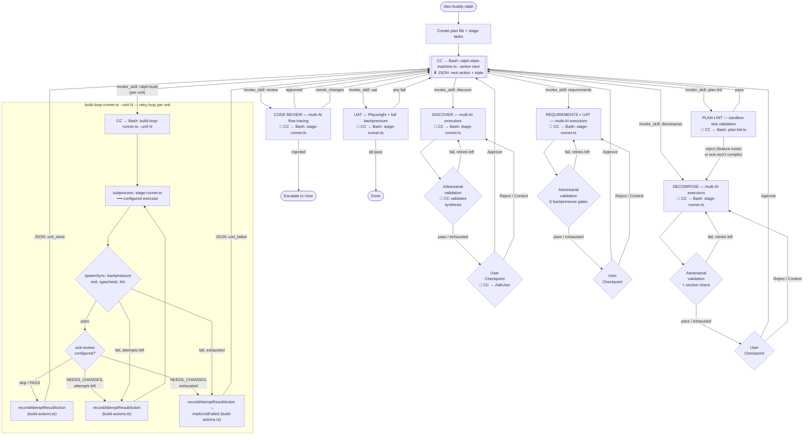

<div align="center">

# Dev Buddy

**Break the AI echo chamber. Ship correct features.**


</div>

---

## The Problem

When one AI writes your code and the same AI reviews it, you get a rubber stamp. Same-family models share training biases and blind spots. Mechanical backpressure (tests, types, lint) catches compilation errors but not semantic drift — when code technically works but doesn't match intent.

---

## The Solution: Ralph Loop Architecture

Dev Buddy implements a **Ralph loop** workflow ([Ralph Wiggum technique](https://ghuntley.com/ralph/)) — fresh context per iteration, specs on disk, iterate until correct.

```mermaid
sequenceDiagram
    actor User
    participant CC as CC Main Process<br/>(LLM / Ralph skill)
    participant SM as ralph-state-<br/>machine.ts
    participant SR as stage-runner.ts
    participant BLR as build-loop-<br/>runner.ts
    participant EX as Configured<br/>Executors
    participant FS as Plan + Unit<br/>Files on Disk

    Note over CC: /dev-buddy-ralph <feature>
    CC->>FS: Write plan file (Status: discover)

    rect rgb(230, 240, 255)
        Note over CC,EX: DISCOVER / REQUIREMENTS / DECOMPOSE (same pattern × 3)
        CC->>SM: Bash: --plan X --action next
        SM->>FS: Read plan + state
        SM-->>CC: JSON: {actions: [invoke_skill(stage)]}
        CC->>SR: Bash: --stage-type <stage> --task-stdin
        SR->>EX: Dispatch parallel/sequential executors
        EX-->>SR: Per-executor outputs
        SR-->>CC: JSON: {synthesis, worker_outputs[]}
        CC->>CC: Validate synthesis (adversarial)
        CC->>FS: Write stage section + Status: X-review
        CC->>SM: Bash: --action next
        SM-->>CC: JSON: {user_checkpoint, askUserQuestion, approveStatus,<br/>rejectStatus, feedbackQuestion}
        CC->>User: AskUserQuestion(askUserQuestion)
        User-->>CC: approve | request changes
        alt approve
            CC->>FS: Write approveStatus to plan
        else request changes
            CC->>User: AskUserQuestion(feedbackQuestion)
            User-->>CC: free-text (via "Other") or preset label
            CC->>FS: Write ## Feedback + rejectStatus to plan
            Note over CC: Loop — stage re-runs with ## Feedback as context
        end
    end

    rect rgb(255, 235, 220)
        Note over CC,FS: PLAN-LINT — validates decomposition before build attempts
        CC->>SM: Bash: --action next
        SM-->>CC: JSON: {invoke_skill(plan-lint)}
        CC->>CC: Bash: plan-lint.ts --plan X --cwd Y
        alt plan-lint pass
            CC->>SM: Bash: --action next
        else plan-lint rejects
            CC->>FS: Write feedback + Status: decompose
            Note over CC: Re-enters decompose before BUILD
        end
    end

    rect rgb(255, 235, 220)
        Note over CC,FS: BUILD — per-unit dispatch, retries internal to runner
        loop For each unit (CC drives via state machine)
            CC->>SM: Bash: --action next
            SM-->>CC: JSON: {invoke_skill(ralph-build, unitId, unitPath)}
            CC->>CC: TaskUpdate(unit N → in_progress)
            CC->>BLR: Bash: --plan X --cwd Y --unit N
            loop Retry loop (mechanical, inside runner)
                BLR->>BLR: composeBuildDispatch(projectDir, slug, unitId)<br/>[reserves attempt via build-actions.ts]
                BLR->>SR: subprocess: --stage-type ralph-build --task-stdin<br/>(prompt = STATIC PLAN + [PRIOR MECHANICAL FAILURE] + PRIOR REVIEW FEEDBACK + INSTRUCTION)
                SR->>EX: Dispatch configured build executor
                EX-->>SR: Implementation result
                SR-->>BLR: JSON: {synthesis}
                BLR->>BLR: runBackpressure(commands, cwd) + verifyContract
                alt all backpressure + contract pass
                    opt unit-review configured
                        BLR->>SR: subprocess: --stage-type unit-review --plan --cwd --unit N<br/>(stage-runner composes review task itself)
                        SR->>EX: Dispatch reviewer executor(s)
                        EX-->>SR: Review verdict
                        SR-->>BLR: JSON: {synthesis: PASS|NEEDS_CHANGES}
                        Note over BLR: Fail-closed parsing: malformed output → NEEDS_CHANGES
                        BLR->>BLR: recordReviewResultAction handles pass, retry, or failure
                    end
                    alt no unit-review configured
                        BLR->>BLR: recordAttemptResultAction marks unit done
                    end
                else fail + attempts remain
                    Note over BLR: mechanicalContext classified and passed to build-actions
                    BLR->>BLR: recordAttemptResultAction schedules retry
                else fail + exhausted
                    BLR->>BLR: recordAttemptResultAction marks unit failed
                end
            end
            Note over BLR,FS: All state writes go through build-actions.ts<br/>BLR never writes state directly.
            BLR-->>CC: JSON: {event: complete, status: done|failed|stuck, reason, orchestratorHints?}
            CC->>CC: TaskUpdate unit N with outcome note
        end
    end

    CC->>SM: Bash: --action next

    rect rgb(220, 245, 220)
        Note over CC,EX: CODE REVIEW
        SM-->>CC: JSON: {invoke_skill(review)}
        CC->>SR: Bash: --stage-type ralph-code-review
        SR->>EX: Dispatch reviewer executors
        EX-->>SR: Verdict + AC tracing
        SR-->>CC: JSON: {synthesis: approved|needs_changes}
    end

    alt verdict = needs_changes
        CC->>SM: Bash: --action next
        SM-->>CC: JSON: {write_plan(review→build)}
        CC->>FS: Apply write_plan edits
        Note over CC: Re-enters build loop via SM query
    else verdict = approved
        rect rgb(240, 230, 250)
            Note over CC,EX: UAT
            CC->>SM: Bash: --action next
            SM-->>CC: JSON: {invoke_skill(uat)}
            CC->>SR: Bash: --stage-type ralph-uat
            SR->>EX: Execute Playwright tests
            EX-->>SR: Test results (pass/fail per UAT)
            SR-->>CC: JSON: {synthesis}
        end
    end

    alt all UATs pass
        CC->>SM: Bash: --action next
        SM-->>CC: JSON: {write_plan(uat→done), done}
        CC->>FS: Apply write_plan
        CC-->>User: Pipeline complete
    else any UAT fail
        CC->>SM: Bash: --action next
        SM-->>CC: JSON: {write_plan(uat→build)}
        CC->>FS: Apply write_plan
        Note over CC: Re-enters build loop via SM query
    end
```





**Mechanical failure context:** on a non-zero exit from dispatch or backpressure, the runner captures stdout+stderr head+tail excerpts (≤1000 chars each, verbatim) and passes them to `recordAttemptResultAction`, which persists them into `unit-N.json` for the next attempt's `composeBuildDispatch` call to fold into the retry prompt as a `--- PRIOR MECHANICAL FAILURE ---` block. Mechanical context and review feedback survive process restarts; cross-attempt carry is always disk-backed, never in-memory.

**Script enforcement boundaries:**
- **ralph-state-machine.ts** (passive) — Computes next action when queried. CC calls it via Bash before every stage transition. Reads plan + unit files, returns JSON with the next action. Never drives execution.
- **stage-runner.ts** (dispatch) — Multi-executor dispatcher. CC calls it via Bash for all stages. Loads config, resolves system prompts, spawns executors (subscription/API/CLI), synthesizes outputs.
- **build-loop-runner.ts** (per-unit driver) — Runs one unit's full loop by calling `build-actions.ts`'s three action functions in-process: `composeBuildDispatch` → subprocess dispatch → backpressure + contract-verify → `recordAttemptResultAction` → (optional) unit-review dispatch → `recordReviewResultAction`. Owns subprocess dispatch, I/O, and event streaming only. Zero state-transition policy; zero direct writes to `unit-N.json` or `unit-N.md`. Streams one JSON event per transition (`attempt_start`, `review_start`, `review_verdict`, `complete`); final `complete` line carries terminal `status` (`done|failed|stuck`).
- **CC Main Process** (LLM) — Drives the pipeline: queries SM, invokes scripts, validates synthesis, presents user checkpoints, updates tasks. Drives unit-to-unit build progression via state machine queries and task management.

**Per-unit state layout:** runtime state lives in `.vcp/plan/.state/ralph-{slug}/` — one small JSON per unit, not a single monolith. Layout:
```
.state/ralph-{slug}/
├── plan.json              # plan-level: DAG, status, iterations, completedAt
├── units/
│   ├── unit-1.json        # per-unit: status, attempts, reviewFeedback, mechanicalContext
│   └── unit-N.json
└── progress/
    └── stage-progress-*.json
```
Unit plan files (`unit-N.md`) are immutable after decompose — all dynamic state (review feedback, attempt history, mechanical context) lives in `units/unit-N.json`. Writes go through `ralph/build-actions.ts` action functions (which internally call `ralph/unit-state.ts` with invariant guards); BLR and SM CLI both drive those same three functions so policy lives in one place.

**Retention:** completed plans (those with `plan.json.completedAt` set by the state machine) are auto-archived to `.vcp/plan/.archive/` after 7 days. Configurable via `retention_days` in `~/.vcp/dev-buddy.json` (0 disables). Sweep runs once per 24h (configurable via `sweep_interval_hours`), gated by a `.sweep.marker` file. Archives are recoverable — `mv` the directory back to restore.

**Task-board projection:** the CC orchestrator creates one task per stage with `blockedBy` chaining, then (post-decompose) registers a unit task per decomposition unit with `blockedBy` mirroring the unit DAG. Bulk registration happens via `ralph-state-machine.ts --action register-task-graph` (single atomic state write). `--action verify-task-graph` warns on drift at every subsequent build-stage `next` query without blocking execution — unit-file `dependsOn` remains authoritative for build ordering; the task board is a human-visibility projection of that DAG.

**Two nested loops + review gate:**
- **Inner (BUILD -> CODE REVIEW):** per-unit Ralph loop — fresh context from disk, implement, mechanical backpressure (test/typecheck/lint), optional per-unit semantic review, retry up to `max_build_attempts`. Code review can send units back for rework. Per-unit state is persisted in `.vcp/plan/.state/ralph-{slug}/units/unit-N.json`; unit-N.md is immutable after decompose. Unit-to-unit progression is driven by the CC orchestrator via `ralph-state-machine.ts --action next`; BLR drives the intra-unit loop via in-process calls to `ralph/build-actions.ts` action functions (never touches `unit-state.ts` directly).
- **Outer (UAT):** integration Ralph loop — real Playwright UAT against running app. Failures identify affected units and loop back through BUILD and CODE REVIEW (up to `max_outer_iterations`).
- **User checkpoints** after Discovery, Requirements, and Decompose — approve, reject, or provide additional context. Each stage runs internal adversarial validation before presenting to the user.

---

## Ralph Pipeline Stages

| Stage | What Happens | Multi-AI |
|-------|-------------|----------|
| **Discovery** | Explore codebase + running app. Map code paths, patterns, impact points. Screenshot current state. | Yes |
| **Requirements + UAT** | Define ACs (Given/When/Then + misinterpretation). Design Playwright UAT scenarios. Risk registry. | Yes |
| **Decomposition** | Break into ~50 LOC units. Each unit gets its own plan file with precise instructions. | Yes |
| **Plan-lint** | Run each unit's backpressure commands against HEAD. Reject if tests pass (feature exists) or won't compile. No build attempts consumed. | No |
| **Build** | Per-unit implementation with fresh context. Runner runs backpressure + optional semantic review. | Configurable |
| **Code Review** | Flow tracing (point + path + intent). Stub/orphan detection. Cross-unit integration. | Yes |
| **UAT** | Execute Playwright tests + all mechanical backpressure against running app. | Single |

Dev Buddy has 8 stage definition files: the 6 pipeline stages above, `plan-lint`, and optional `unit-review`. `unit-review` is disabled by default and runs only when its stage has executors configured.

---

## The 10-Layer Enforcement Stack

```
Layer 1: Unit plan + contracts     <- intent, data flow traces, authoritative sources
Layer 2: Plan-lint                 <- already-satisfied tests, uncompilable tests, bad unit shape
Layer 3: Mechanical backpressure   <- compilation, types, lint errors
Layer 4: Per-unit semantic review  <- AC tracing, contract verification (optional, multi-AI)
Layer 5: Orchestrator verify       <- subagent lies, missing sections, source violations
Layer 6: Code review (multi-AI)    <- flow tracing, stub detection, drift probe
Layer 7: UAT (Playwright)          <- real user scenario failures
Layer 8: User checkpoint           <- everything above missed
Layer 9: TaskManagement            <- process compliance (no skipping)
Layer 10: Disk-backed JSON state   <- state survival after compaction and process restart
```

Each layer catches what the layers above missed. With weaker models, more layers fire. With stronger models, most pass through cleanly.

---

## Quick Start

```bash
# Install Dev Buddy
/plugin install vcp@dev-buddy

# Run the Ralph workflow
/dev-buddy-ralph Add user authentication with JWT

# Configure via web portal
/dev-buddy-config

# Multi-AI debate on any topic
/dev-buddy-chatroom Should we use REST or GraphQL?

# Run a single task with a specific AI
/dev-buddy-once --preset openai-api --model gpt-5.4 "Review auth middleware"
```

---

## MCP Workflow Prompts

Dev Buddy slash-command skills are launchers. The authoritative workflow instructions are exposed by the Dev Buddy MCP server:

- Workflow prompts: `dev_buddy_ralph`, `dev_buddy_once`, `dev_buddy_chatroom`, and one per stage skill
- Workflow resources: `dev-buddy://prompts/<command>`, such as `dev-buddy://prompts/dev-buddy-ralph`
- Fallback tool: `get_prompt({ command, host, arguments, project_path })`

The prompt text may instruct the caller to use Dev Buddy MCP tools such as `ralph_start`, `ralph_next`, `get_run_state`, `get_stage_definition`, and `list_presets`.

### Host Guidance

The Dev Buddy MCP server also exposes caller-specific instructions through:

- Prompt: `host_instructions`
- Tool: `get_host_instructions({ host: "claude" | "codex", command?: "overview" | "ralph" | "config" | "once" | "chatroom" | "legacy-stages" })`
- Resources: `dev-buddy://host-instructions/claude`, `dev-buddy://host-instructions/codex`

Use the tool path when MCP resources are not guaranteed to be auto-injected into model context.

## Skills Reference

| Skill | Command | Description |
|-------|---------|-------------|
| Ralph | `/dev-buddy-ralph <description>` | Full pipeline orchestrator — chains all 6 stages with loop logic |
| Discover | `/dev-buddy-discover` | Discovery stage — multi-AI codebase and running app exploration |
| Requirements | `/dev-buddy-requirements` | Requirements + UAT design — acceptance criteria and test scenarios |
| Decompose | `/dev-buddy-decompose` | Decomposition — break features into small units of work |
| Build | `/dev-buddy-build` | Build stage — per-unit implementation with backpressure |
| Code Review | `/dev-buddy-code-review` | Code review — multi-AI semantic drift detection |
| UAT | `/dev-buddy-uat` | UAT stage — execute tests against the running app |
| Plan Lint | `/dev-buddy-plan-lint` | Validate decomposition output before build attempts are consumed |
| Chatroom | `/dev-buddy-chatroom <topic>` | Multi-AI competitive debate with iterative consensus |
| Once | `/dev-buddy-once` | Run a single task using a specific AI provider and model |
| Config | `/dev-buddy-config` | Web portal for managing stages, presets, system prompts, and settings |

Each stage skill works standalone (reads existing plan files) or as part of the `/dev-buddy-ralph` pipeline.

## Agents Reference

| Agent | Stage | Role |
|-------|-------|------|
| discoverer | Discovery | Codebase + app explorer |
| ralph-requirements-analyst | Requirements | AC + UAT designer |
| decomposer | Decomposition | Task breakdown specialist |
| unit-builder | Build | Focused unit implementer |
| unit-reviewer | Build (review) | Per-unit AC verifier (optional) |
| ralph-code-reviewer | Code Review | Semantic drift detector |
| uat-evaluator | UAT | Pessimistic test executor |

---

## Configuration

The config (`~/.vcp/dev-buddy.json`, version `5.0`) stores:
- **Stages:** Per-stage executor assignments (system prompt + preset + model)
- **Pipeline:** Ralph pipeline (6 stages in fixed order); `plan-lint` and `unit-review` are stage definitions outside the linear pipeline
- **Settings:** config_port, max_iterations, max_build_attempts, max_outer_iterations, max_discovery_iterations, max_requirements_iterations, max_decomposition_iterations, theme

Use the web portal (`/dev-buddy-config`) or edit JSON directly.

<details>
<summary><strong>Example: config v5.0</strong></summary>

```json
{
  "version": "5.0",
  "stages": {
    "discovery": { "executors": [
      { "system_prompt": "discoverer", "preset": "anthropic-subscription", "model": "sonnet", "parallel": true },
      { "system_prompt": "discoverer", "preset": "openai-api", "model": "o3", "parallel": true }
    ]},
    "ralph-requirements": { "executors": [
      { "system_prompt": "ralph-requirements-analyst", "preset": "anthropic-subscription", "model": "opus" }
    ]},
    "decomposition": { "executors": [
      { "system_prompt": "decomposer", "preset": "anthropic-subscription", "model": "opus" }
    ]},
    "ralph-build": { "executors": [
      { "system_prompt": "unit-builder", "preset": "anthropic-subscription", "model": "sonnet" }
    ]},
    "ralph-code-review": { "executors": [
      { "system_prompt": "ralph-code-reviewer", "preset": "anthropic-subscription", "model": "sonnet", "parallel": true },
      { "system_prompt": "ralph-code-reviewer", "preset": "openai-api", "model": "o3", "parallel": true }
    ]},
    "ralph-uat": { "executors": [
      { "system_prompt": "uat-evaluator", "preset": "anthropic-subscription", "model": "sonnet" }
    ]},
    "unit-review": { "executors": [] }
  },
  "pipelines": { "ralph": ["discovery", "ralph-requirements", "decomposition", "ralph-build", "ralph-code-review", "ralph-uat"] },
  "config_port": 8888,
  "max_iterations": 10,
  "max_build_attempts": 3,
  "max_outer_iterations": 3,
  "max_discovery_iterations": 3,
  "max_requirements_iterations": 3,
  "max_decomposition_iterations": 2
}
```

</details>

### Migration from v0.3.x

Configs auto-migrate on first load. Old stage types map to Ralph equivalents:

| Old Stage | New Stage |
|-----------|-----------|
| requirements | ralph-requirements |
| planning | decomposition |
| plan-review | discovery |
| implementation | ralph-build |
| code-review | ralph-code-review |
| rca | discovery |

Presets and models are preserved. Old pipelines are replaced with the `ralph` pipeline.

---

## Prerequisites

- **[Bun](https://bun.sh/)** - Required for Dev Buddy scripts and the MCP server
- **[Claude Code](https://code.claude.com/)** or **[OpenAI Codex CLI v0.124.0+](https://github.com/openai/codex)** - Claude stage skills are the production Ralph path in v0.6.0; Codex can invoke skills and MCP skeleton tools

---

## Documentation

Full documentation is on the **[VCP Wiki](https://github.com/Z-M-Huang/vcp/wiki)**.

---

## License

[Apache License 2.0](../../LICENSE.md)
