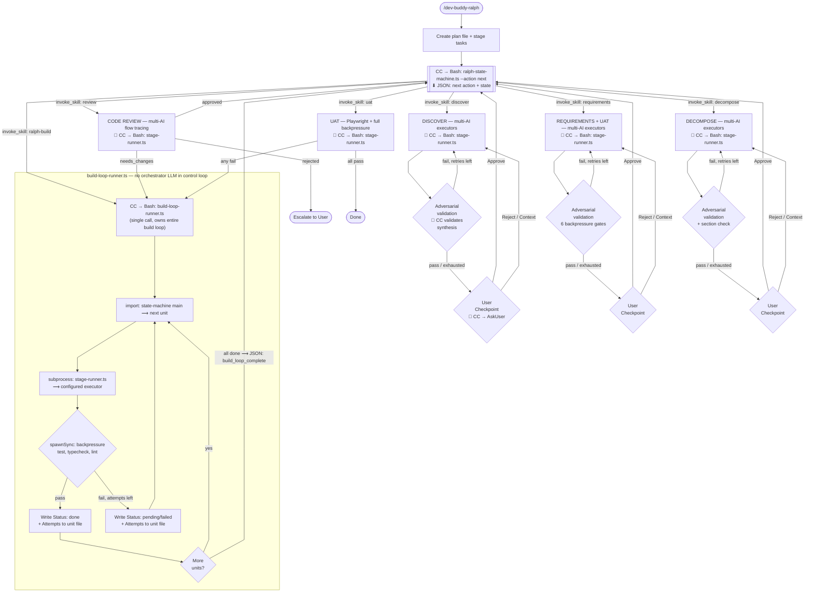
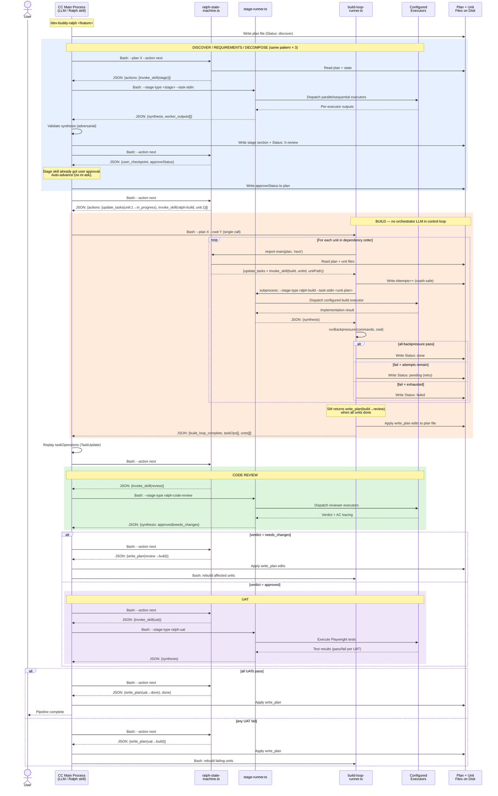

<div align="center">

# Dev Buddy

**Break the AI echo chamber. Ship correct features.**


</div>

---

## The Problem

When one AI writes your code and the same AI reviews it, you get a rubber stamp. Same-family models share training biases and blind spots. Mechanical backpressure (tests, types, lint) catches compilation errors but not semantic drift — when code technically works but doesn't match intent.

---

## The Solution: Ralph Loop Architecture

Dev Buddy implements a **Ralph loop** workflow ([Ralph Wiggum technique](https://ghuntley.com/ralph/)) — fresh context per iteration, specs on disk, iterate until correct.





**Script enforcement boundaries:**
- **ralph-state-machine.ts** (passive) — Computes next action when queried. CC calls it via Bash before every stage transition. Reads plan + unit files, returns JSON with the next action. Never drives execution.
- **stage-runner.ts** (dispatch) — Multi-executor dispatcher. CC calls it via Bash for all 6 stages. Loads config, resolves system prompts, spawns executors (subscription/API/CLI), synthesizes outputs.
- **build-loop-runner.ts** (mechanical loop) — Owns the entire build inner loop. CC calls it once via Bash; it loops internally: queries SM (import), dispatches executor (subprocess to stage-runner), runs backpressure (spawnSync), writes unit status (fs). Returns one JSON blob when done.
- **CC Main Process** (LLM) — Drives the outer pipeline: queries SM, invokes scripts, validates synthesis, presents user checkpoints, replays task operations. Does NOT execute the build inner loop.

**Two nested loops + review gate:**
- **Inner (BUILD -> CODE REVIEW):** per-unit Ralph loop — fresh context from disk, implement, mechanical backpressure (test/typecheck/lint), retry up to `max_build_attempts`. Code review can send units back for rework. Build inner loop is fully mechanical via `build-loop-runner.ts`.
- **Outer (UAT):** integration Ralph loop — real Playwright UAT against running app. Failures identify affected units and loop back through BUILD and CODE REVIEW (up to `max_outer_iterations`).
- **User checkpoints** after Discovery, Requirements, and Decompose — approve, reject, or provide additional context. Each stage runs internal adversarial validation before presenting to the user.

---

## The 6 Stages

| Stage | What Happens | Multi-AI |
|-------|-------------|----------|
| **Discovery** | Explore codebase + running app. Map code paths, patterns, impact points. Screenshot current state. | Yes |
| **Requirements + UAT** | Define ACs (Given/When/Then + misinterpretation). Design Playwright UAT scenarios. Risk registry. | Yes |
| **Decomposition** | Break into ~50 LOC units. Each unit gets its own plan file with precise instructions. | Yes |
| **Build** | Per-unit implementation with fresh context. Orchestrator independently runs backpressure. | Single |
| **Code Review** | Flow tracing (point + path + intent). Stub/orphan detection. Cross-unit integration. | Yes |
| **UAT** | Execute Playwright tests + all mechanical backpressure against running app. | Single |

---

## The 8-Layer Enforcement Stack

```
Layer 1: Unit plan + contracts   <- intent, data flow traces, authoritative sources
Layer 2: Mechanical backpressure <- compilation, types, lint errors
Layer 3: Orchestrator verify     <- subagent lies, missing sections, source violations
Layer 4: Code review (multi-AI)  <- flow tracing, stub detection, drift probe
Layer 5: UAT (Playwright)        <- real user scenario failures
Layer 6: User checkpoint         <- everything above missed
Layer 7: TaskManagement          <- process compliance (no skipping)
Layer 8: Plan files on disk      <- state survival after compaction
```

Each layer catches what the layers above missed. With weaker models, more layers fire. With stronger models, most pass through cleanly.

---

## Quick Start

```bash
# Install Dev Buddy
/plugin install vcp@dev-buddy

# Run the Ralph workflow
/dev-buddy-ralph Add user authentication with JWT

# Configure via web portal
/dev-buddy-config

# Multi-AI debate on any topic
/dev-buddy-chatroom Should we use REST or GraphQL?

# Run a single task with a specific AI
/dev-buddy-once --preset openai-api --model gpt-5.4 "Review auth middleware"
```

---

## Skills Reference

| Skill | Command | Description |
|-------|---------|-------------|
| Ralph | `/dev-buddy-ralph <description>` | Full pipeline orchestrator — chains all 6 stages with loop logic |
| Discover | `/dev-buddy-discover` | Discovery stage — multi-AI codebase and running app exploration |
| Requirements | `/dev-buddy-requirements` | Requirements + UAT design — acceptance criteria and test scenarios |
| Decompose | `/dev-buddy-decompose` | Decomposition — break features into small units of work |
| Build | `/dev-buddy-build` | Build stage — per-unit implementation with backpressure |
| Code Review | `/dev-buddy-code-review` | Code review — multi-AI semantic drift detection |
| UAT | `/dev-buddy-uat` | UAT stage — execute tests against the running app |
| Chatroom | `/dev-buddy-chatroom <topic>` | Multi-AI competitive debate with iterative consensus |
| Once | `/dev-buddy-once` | Run a single task using a specific AI provider and model |
| Config | `/dev-buddy-config` | Web portal for managing stages, presets, system prompts, and settings |

Each stage skill works standalone (reads existing plan files) or as part of the `/dev-buddy-ralph` pipeline.

## Agents Reference

| Agent | Stage | Role |
|-------|-------|------|
| discoverer | Discovery | Codebase + app explorer |
| ralph-requirements-analyst | Requirements | AC + UAT designer |
| decomposer | Decomposition | Task breakdown specialist |
| unit-builder | Build | Focused unit implementer |
| ralph-code-reviewer | Code Review | Semantic drift detector |
| uat-evaluator | UAT | Pessimistic test executor |

---

## Configuration

The config (`~/.vcp/dev-buddy.json`, version `5.0`) stores:
- **Stages:** Per-stage executor assignments (system prompt + preset + model)
- **Pipeline:** Ralph pipeline (6 stages in fixed order)
- **Settings:** config_port, max_iterations, max_build_attempts, max_outer_iterations, max_discovery_iterations, max_requirements_iterations, max_decomposition_iterations, theme

Use the web portal (`/dev-buddy-config`) or edit JSON directly.

<details>
<summary><strong>Example: config v5.0</strong></summary>

```json
{
  "version": "5.0",
  "stages": {
    "discovery": { "executors": [
      { "system_prompt": "discoverer", "preset": "anthropic-subscription", "model": "sonnet", "parallel": true },
      { "system_prompt": "discoverer", "preset": "openai-api", "model": "o3", "parallel": true }
    ]},
    "ralph-requirements": { "executors": [
      { "system_prompt": "ralph-requirements-analyst", "preset": "anthropic-subscription", "model": "opus" }
    ]},
    "decomposition": { "executors": [
      { "system_prompt": "decomposer", "preset": "anthropic-subscription", "model": "opus" }
    ]},
    "ralph-build": { "executors": [
      { "system_prompt": "unit-builder", "preset": "anthropic-subscription", "model": "sonnet" }
    ]},
    "ralph-code-review": { "executors": [
      { "system_prompt": "ralph-code-reviewer", "preset": "anthropic-subscription", "model": "sonnet", "parallel": true },
      { "system_prompt": "ralph-code-reviewer", "preset": "openai-api", "model": "o3", "parallel": true }
    ]},
    "ralph-uat": { "executors": [
      { "system_prompt": "uat-evaluator", "preset": "anthropic-subscription", "model": "sonnet" }
    ]}
  },
  "pipelines": { "ralph": ["discovery", "ralph-requirements", "decomposition", "ralph-build", "ralph-code-review", "ralph-uat"] },
  "config_port": 8888,
  "max_iterations": 10,
  "max_build_attempts": 3,
  "max_outer_iterations": 3,
  "max_discovery_iterations": 3,
  "max_requirements_iterations": 3,
  "max_decomposition_iterations": 2
}
```

</details>

### Migration from v0.3.x

Configs auto-migrate on first load. Old stage types map to Ralph equivalents:

| Old Stage | New Stage |
|-----------|-----------|
| requirements | ralph-requirements |
| planning | decomposition |
| plan-review | discovery |
| implementation | ralph-build |
| code-review | ralph-code-review |
| rca | discovery |

Presets and models are preserved. Old pipelines are replaced with the `ralph` pipeline.

---

## Prerequisites

- **[Bun](https://bun.sh/)** - Required for hook execution
- **[Claude Code](https://code.claude.com/)** - The AI coding assistant

---

## Documentation

Full documentation is on the **[VCP Wiki](https://github.com/Z-M-Huang/vcp/wiki)**.

---

## License

[Apache License 2.0](../../LICENSE.md)
