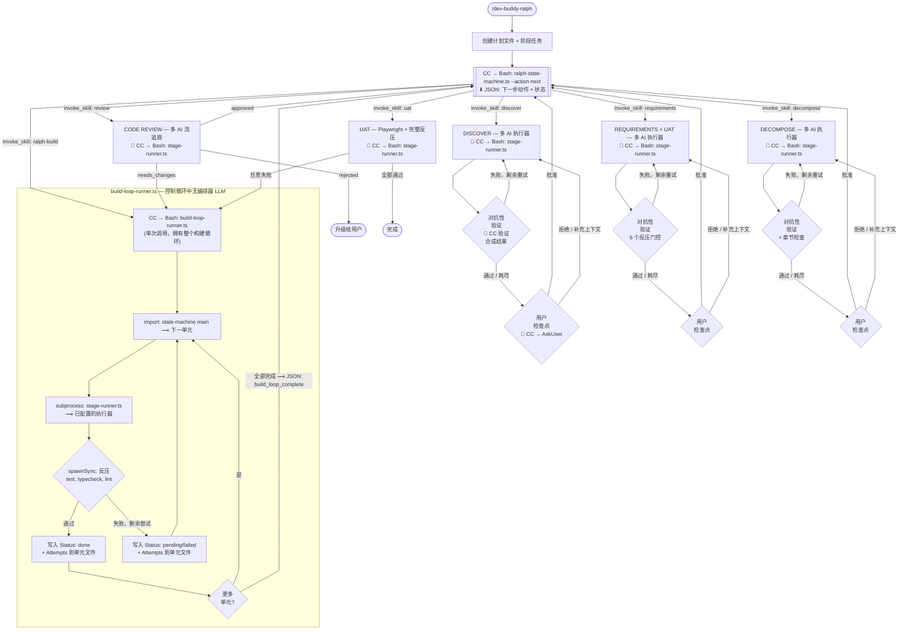
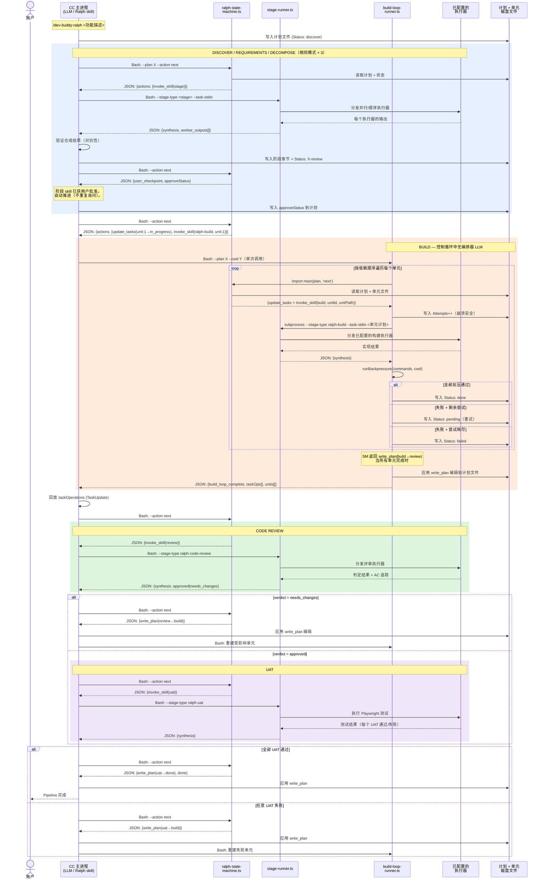

<div align="center">

# Dev Buddy

**打破 AI 回音壁。交付正确的功能。**


</div>

---

## 问题

当一个 AI 编写代码，同一个 AI 又来评审，你得到的只是橡皮图章。同系列模型共享训练偏差和盲点。机械反压（测试、类型检查、lint）能捕获编译错误，但捕获不了语义漂移——代码技术上能工作，但与意图不符。

---

## 解决方案：Ralph 循环架构

Dev Buddy 实现了 **Ralph 循环**工作流（[Ralph Wiggum 技术](https://ghuntley.com/ralph/)）——每次迭代全新上下文，规格写在磁盘上，反复迭代直到正确。





**脚本执行边界：**
- **ralph-state-machine.ts**（被动）— 被查询时计算下一步动作。CC 在每次阶段转换前通过 Bash 调用它。读取计划 + 单元文件，返回 JSON 格式的下一步动作。从不主动驱动执行。
- **stage-runner.ts**（分发）— 多执行器分发器。CC 通过 Bash 为全部 6 个阶段调用它。加载配置，解析系统提示词，生成执行器（subscription/API/CLI），合成输出。
- **build-loop-runner.ts**（机械循环）— 拥有整个构建内循环。CC 通过 Bash 调用一次；它在内部循环：查询 SM（import），分发执行器（subprocess 到 stage-runner），运行反压（spawnSync），写入单元状态（fs）。完成时返回一个 JSON 数据包。
- **CC 主进程**（LLM）— 驱动外层 pipeline：查询 SM，调用脚本，验证合成结果，展示用户检查点，回放任务操作。不执行构建内循环。

**双嵌套循环 + 评审门控：**
- **内循环（BUILD -> CODE REVIEW）：** 逐单元 Ralph 循环——从磁盘读取全新上下文，实现，机械反压（test/typecheck/lint），重试上限 `max_build_attempts`。代码评审可将单元打回重做。构建内循环通过 `build-loop-runner.ts` 完全机械化执行。
- **外循环（UAT）：** 集成 Ralph 循环——对运行中的应用执行 Playwright UAT。失败时定位受影响单元，回到 BUILD 和 CODE REVIEW（上限 `max_outer_iterations`）。
- **用户检查点** 在 Discovery、Requirements 和 Decompose 之后——批准、拒绝或补充上下文。每个阶段在呈现给用户之前先运行内部对抗性验证。

---

## 6 个阶段

| 阶段 | 执行内容 | 多 AI |
|------|----------|-------|
| **Discovery** | 探索代码库 + 运行中的应用。映射代码路径、模式、影响点。截图当前状态。 | 是 |
| **Requirements + UAT** | 定义 AC（Given/When/Then + 误解释）。设计 Playwright UAT 场景。风险注册表。 | 是 |
| **Decomposition** | 分解为约 50 行代码的单元。每个单元有独立的计划文件和精确指令。 | 是 |
| **Build** | 逐单元实现，全新上下文。编排器独立运行反压。 | 单一 |
| **Code Review** | 流追踪（定点 + 路径 + 意图）。桩/孤立代码检测。跨单元集成。 | 是 |
| **UAT** | 对运行中的应用执行 Playwright 测试 + 全部机械反压。 | 单一 |

---

## 8 层执行栈

```
第 1 层：单元计划 + 合约      <- 意图、数据流追踪、权威来源
第 2 层：机械反压             <- 编译、类型、lint 错误
第 3 层：编排器验证           <- 谎报测试、缺失节、来源违反
第 4 层：代码评审（多 AI）    <- 流追踪、桩检测、漂移探测
第 5 层：UAT（Playwright）    <- 真实用户场景失败
第 6 层：用户检查点           <- 以上全部遗漏的
第 7 层：TaskManagement       <- 流程合规（不跳步）
第 8 层：磁盘上的计划文件     <- 上下文压缩后状态存活
```

每一层捕获上层遗漏的问题。模型越弱，触发的层越多。模型越强，大多数层直接通过。

---

## 快速开始

```bash
# 安装 Dev Buddy
/plugin install vcp@dev-buddy

# 运行 Ralph 工作流
/dev-buddy-ralph 添加基于 JWT 的用户认证

# 通过 Web 门户配置
/dev-buddy-config

# 多 AI 辩论任意主题
/dev-buddy-chatroom 应该用 REST 还是 GraphQL？

# 使用指定 AI 运行单个任务
/dev-buddy-once --preset openai-api --model gpt-5.4 "评审 auth 中间件"
```

---

## Skill 参考

| Skill | 命令 | 描述 |
|-------|------|------|
| Ralph | `/dev-buddy-ralph <描述>` | 完整 pipeline 编排器——串联全部 6 个阶段，包含循环逻辑 |
| Discover | `/dev-buddy-discover` | Discovery 阶段——多 AI 代码库和运行应用探索 |
| Requirements | `/dev-buddy-requirements` | 需求 + UAT 设计——验收标准和测试场景 |
| Decompose | `/dev-buddy-decompose` | 分解——将功能拆分为小的工作单元 |
| Build | `/dev-buddy-build` | Build 阶段——逐单元实现，带反压 |
| Code Review | `/dev-buddy-code-review` | 代码评审——多 AI 语义漂移检测 |
| UAT | `/dev-buddy-uat` | UAT 阶段——对运行中的应用执行测试 |
| Chatroom | `/dev-buddy-chatroom <主题>` | 多 AI 竞争辩论，迭代达成共识 |
| Once | `/dev-buddy-once` | 使用指定 AI provider 和模型运行单个任务 |
| Config | `/dev-buddy-config` | 管理阶段、preset、系统提示词和设置的 Web 门户 |

每个阶段 skill 可独立运行（读取已有计划文件），也可作为 `/dev-buddy-ralph` pipeline 的一部分。

## Agent 参考

| Agent | 阶段 | 角色 |
|-------|------|------|
| discoverer | Discovery | 代码库 + 应用探索者 |
| ralph-requirements-analyst | Requirements | AC + UAT 设计师 |
| decomposer | Decomposition | 任务分解专家 |
| unit-builder | Build | 专注的单元实现者 |
| ralph-code-reviewer | Code Review | 语义漂移检测器 |
| uat-evaluator | UAT | 悲观主义测试执行者 |

---

## 配置

配置文件（`~/.vcp/dev-buddy.json`，版本 `5.0`）存储：
- **Stages：** 每阶段执行器分配（系统提示词 + preset + 模型）
- **Pipeline：** Ralph pipeline（6 个阶段，固定顺序）
- **Settings：** config_port, max_iterations, max_build_attempts, max_outer_iterations, max_discovery_iterations, max_requirements_iterations, max_decomposition_iterations, theme

使用 Web 门户（`/dev-buddy-config`）或直接编辑 JSON。

<details>
<summary><strong>示例：v5.0 配置</strong></summary>

```json
{
  "version": "5.0",
  "stages": {
    "discovery": { "executors": [
      { "system_prompt": "discoverer", "preset": "anthropic-subscription", "model": "sonnet", "parallel": true },
      { "system_prompt": "discoverer", "preset": "openai-api", "model": "o3", "parallel": true }
    ]},
    "ralph-requirements": { "executors": [
      { "system_prompt": "ralph-requirements-analyst", "preset": "anthropic-subscription", "model": "opus" }
    ]},
    "decomposition": { "executors": [
      { "system_prompt": "decomposer", "preset": "anthropic-subscription", "model": "opus" }
    ]},
    "ralph-build": { "executors": [
      { "system_prompt": "unit-builder", "preset": "anthropic-subscription", "model": "sonnet" }
    ]},
    "ralph-code-review": { "executors": [
      { "system_prompt": "ralph-code-reviewer", "preset": "anthropic-subscription", "model": "sonnet", "parallel": true },
      { "system_prompt": "ralph-code-reviewer", "preset": "openai-api", "model": "o3", "parallel": true }
    ]},
    "ralph-uat": { "executors": [
      { "system_prompt": "uat-evaluator", "preset": "anthropic-subscription", "model": "sonnet" }
    ]}
  },
  "pipelines": { "ralph": ["discovery", "ralph-requirements", "decomposition", "ralph-build", "ralph-code-review", "ralph-uat"] },
  "config_port": 8888,
  "max_iterations": 10,
  "max_build_attempts": 3,
  "max_outer_iterations": 3,
  "max_discovery_iterations": 3,
  "max_requirements_iterations": 3,
  "max_decomposition_iterations": 2
}
```

</details>

### 从 v0.3.x 迁移

配置在首次加载时自动迁移。旧阶段类型映射到 Ralph 等价物：

| 旧阶段 | 新阶段 |
|--------|--------|
| requirements | ralph-requirements |
| planning | decomposition |
| plan-review | discovery |
| implementation | ralph-build |
| code-review | ralph-code-review |
| rca | discovery |

Preset 和模型保留不变。旧 pipeline 替换为 `ralph` pipeline。

---

## 前置条件

- **[Bun](https://bun.sh/)** — Hook 执行所需
- **[Claude Code](https://code.claude.com/)** — AI 编码助手

---

## 文档

完整文档请访问 **[VCP Wiki](https://github.com/Z-M-Huang/vcp/wiki)**。

---

## 许可证

[Apache License 2.0](../../LICENSE.md)
