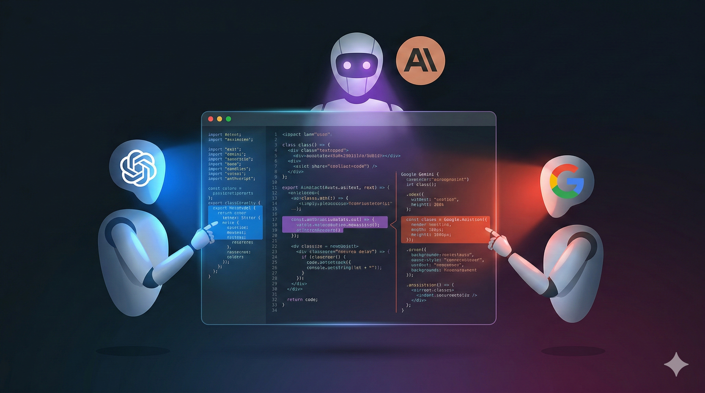
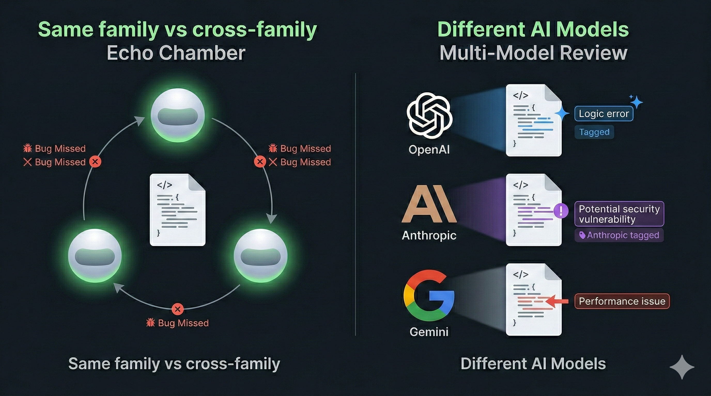
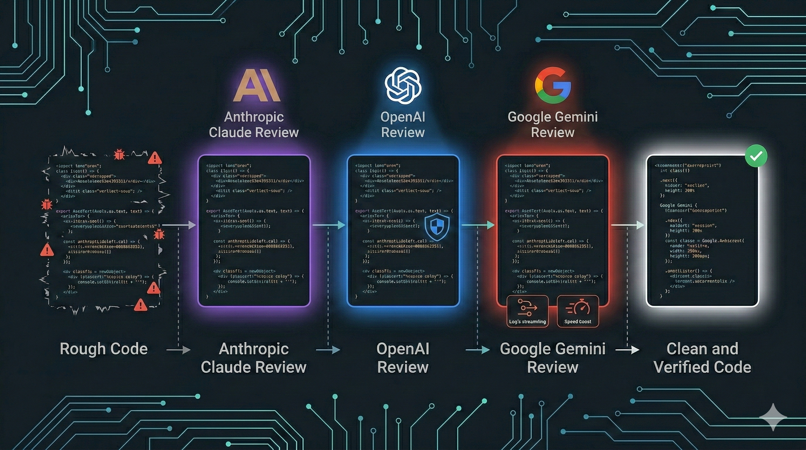
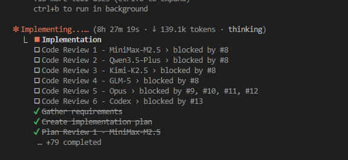
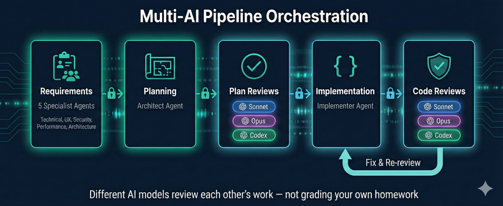

<div align="center">

# Dev Buddy

**打破 AI 回音壁。交付安全代码。**




</div>

---

## 问题

<div align="center">

</div>

当一个 AI 编写你的代码，同一个 AI 又来评审它，你得到的是橡皮图章——而不是真正的评审。同系列模型共享训练偏差、架构血统和盲点。它们遗漏相同类型的 bug。每一次都是如此。

---

## 解决方案

<div align="center">

</div>

Dev Buddy 将代码路由到来自不同 provider 的**独立 AI 评审者**——通过基于任务的执行机制来防止跳过阶段。每个评审者独立运作。评审者之间不共享上下文。没有橡皮图章。

---

## 真实 Pipeline 运行实况

<div align="center">

</div>

*5 个并发评审，横跨 MiniMax、Qwen、Kimi、GLM、Codex —— 每个独立运作，不共享上下文。*

---

## Pipeline

Pipeline 是用户自定义的阶段序列。可根据需要创建任意 pipeline —— 两个默认 pipeline 开箱即用，也可通过 Web 门户（`/dev-buddy-config`）或 JSON 配置自定义。

### 默认 Pipeline

**`feature`** —— 功能开发

```
需求 + TDD → 规划 → 计划评审 → 实现 → 代码评审
```

**`bug-fix`** —— Bug 修复

```
根因分析 → 需求 + TDD → 规划 → 计划评审 → 实现 → 代码评审
```

所有阶段写入**单一计划文件** —— 无散落的产物文件。

### 阶段类型

| 阶段 | 执行内容 |
|------|----------|
| **需求 + TDD** | 收集需求，悲观优先影响分析。在规划前生成 TDD 测试计划（单元测试、端到端测试、技能测试）。构建用户确认的风险注册表。 |
| **规划** | 创建粒度化实现步骤，每步映射 AC 和测试 ID。每步是一个架构单元，带回滚方案。复用现有代码 —— KISS 架构。 |
| **计划评审** | 假设一切都不能工作。验证每个 AC 有步骤和测试。标记覆盖空白、缺失回滚、不必要的新代码。包含误报分析和用户确认检查点。 |
| **实现** | 每步 TDD 循环，TaskManagement 进度跟踪。运行映射测试。完全自动化 —— 无用户提示。 |
| **代码评审** | 假设每个变更都有 bug。用 file:line 证据验证每个 AC。追踪输入 → 处理 → 输出。包含误报分析和用户确认检查点。 |
| **根因分析** | 多个独立分析者悲观追踪调查 bug（追问五次"为什么"，引用 file:line 证据） |

### 自定义 Pipeline

将任意 pipeline 定义为阶段类型的有序数组。Pipeline 名称必须匹配 `/^[a-z0-9][a-z0-9-]*$/`（最长 50 个字符）。通过 Web 门户管理 pipeline —— 支持创建、重命名和删除的完整 CRUD 操作。

---

## 跨 AI 评审门控

不同 AI 模型在每个阶段互相评审对方的工作：

```
Claude Opus 规划 ──→ Claude Sonnet 评审 ──→ Claude Opus 评审 ──→ Codex 评审
                                                                      │
                    Claude Sonnet 实现 ◀──────────────────────────────┘
                          │
                    Claude Sonnet 评审 ──→ Claude Opus 评审 ──→ Codex 评审
```

每次评审都是独立的——评审者看不到彼此的结论。

### 为什么基于任务的执行很重要

| 基于指令（脆弱） | 基于任务（Dev Buddy） |
|-------------------|----------------------|
| "执行 Sonnet → Opus → Codex" | `blockedBy` 阻止 Codex 在 Opus 完成前启动 |
| AI 可以跳过"多余"的步骤 | `TaskList()` 只显示未被阻塞的任务 |
| 无审计轨迹 | 完整的任务历史和元数据 |
| 进度不可见 | 实时任务进度对用户可见 |

---

## 团队化需求收集

功能 pipeline 在编写任何一行代码之前，先启动 5 个专家 agent 并行探索你的代码库：

| 专家 | 关注点 |
|------|--------|
| 技术分析师 | 现有代码库、模式、依赖、需要修改的文件 |
| UX/领域分析师 | 用户工作流、边界情况、可访问性 |
| 安全分析师 | 威胁模型、OWASP 相关性、非功能性安全需求 |
| 性能分析师 | 负载影响、可扩展性、瓶颈、缓存 |
| 架构分析师 | 设计模式、SOLID 原则、可维护性 |

他们的发现为需求收集提供信息——从一开始就产出更丰富、更完整的规格说明。

---

## 可配置 Pipeline

<div align="center">

</div>

配置文件（`~/.vcp/dev-buddy.json`，版本 `4.0`）将 pipeline 存储在 `pipelines` 映射下 —— 每个键是 pipeline 名称，每个值是有序的阶段数组。每个阶段指定类型、provider 和模型。添加、删除或重新排序阶段。按阶段切换 AI provider —— API preset 通过 `protocol` 字段支持 **Anthropic 兼容**和 **OpenAI 兼容**端点。

使用 Web 门户（`/dev-buddy-config`）或直接编辑 JSON。门户支持 pipeline 的完整 CRUD 操作 —— 创建、重命名和删除。

<details>
<summary><strong>示例：v4.0 配置，包含自定义 pipeline</strong></summary>

```json
{
  "version": "4.0",
  "pipelines": {
    "feature": [
      { "type": "requirements", "provider": "anthropic-subscription", "model": "opus" },
      { "type": "planning", "provider": "anthropic-subscription", "model": "opus" },
      { "type": "plan-review", "provider": "anthropic-subscription", "model": "sonnet" },
      { "type": "plan-review", "provider": "anthropic-subscription", "model": "opus" },
      { "type": "plan-review", "provider": "my-codex-preset", "model": "o3" },
      { "type": "implementation", "provider": "anthropic-subscription", "model": "sonnet" },
      { "type": "code-review", "provider": "anthropic-subscription", "model": "sonnet" },
      { "type": "code-review", "provider": "anthropic-subscription", "model": "opus" },
      { "type": "code-review", "provider": "my-codex-preset", "model": "o3" }
    ],
    "bug-fix": [
      { "type": "rca", "provider": "anthropic-subscription", "model": "opus" },
      { "type": "requirements", "provider": "anthropic-subscription", "model": "opus" },
      { "type": "planning", "provider": "anthropic-subscription", "model": "opus" },
      { "type": "plan-review", "provider": "anthropic-subscription", "model": "sonnet" },
      { "type": "implementation", "provider": "anthropic-subscription", "model": "sonnet" },
      { "type": "code-review", "provider": "anthropic-subscription", "model": "sonnet" }
    ]
  }
}
```

</details>

---

## 快速开始

```bash
# 安装 Dev Buddy
/plugin install vcp@dev-buddy

# 运行任意 pipeline
/dev-buddy-run feature 添加基于 JWT 的用户认证

# 已弃用的别名（将在未来版本中移除）：
# /dev-buddy-feature-implement → 请使用 /dev-buddy-run feature
# /dev-buddy-bug-fix → 请使用 /dev-buddy-run bug-fix

# 通过 Web 门户配置 pipeline 阶段和 provider
/dev-buddy-config
```

---

## Skill 参考

| Skill | 命令 | 描述 |
|-------|------|------|
| 运行 Pipeline | `/dev-buddy-run <pipeline-name>` | 运行任意用户定义的 pipeline |
| 功能实现 | `/dev-buddy-feature-implement` | **已弃用** — 请使用 `/dev-buddy-run feature` |
| Bug 修复 | `/dev-buddy-bug-fix` | **已弃用** — 请使用 `/dev-buddy-run bug-fix` |
| 规划 | `/dev-buddy-plan` | 从用户故事创建实现计划，TDD 测试生成 + 步骤到 AC 映射 |
| 评审 | `/dev-buddy-review` | 评审计划（`--plan`）或代码（`--code`），包含误报分析和用户确认检查点 |
| 实现 | `/dev-buddy-implement` | 使用 TDD 循环实现计划，每步后运行测试 |
| 需求 | `/dev-buddy-requirements` | 收集需求，带来源追踪 |
| 根因分析 | `/dev-buddy-rca` | 根因分析，仅输出诊断结果 |
| 单次执行 | `/dev-buddy-once` | 使用指定 AI provider 和模型运行单个任务 |
| 配置 | `/dev-buddy-config` | 管理 pipeline 阶段、provider 和模型的 Web 门户 |
| 管理 Preset | `/dev-buddy-manage-presets` | 列出、添加、更新或删除 AI provider preset |

## Agent 参考

| Agent | 角色 |
|-------|------|
| requirements-gatherer | 将专家发现综合为完整规格说明 |
| planner | 根据需求和代码库分析设计实现计划 |
| plan-reviewer | 评审计划的完整性、正确性和安全性 |
| implementer | 执行计划，创建子任务并设置任务依赖 |
| code-reviewer | 从安全、架构、质量和正确性角度评审代码 |
| root-cause-analyst | 调查 bug 以识别根因与表象 |
| cli-executor | 使用 preset 模板执行基于 CLI 的评审 |

## Hook 参考

| Hook | 触发条件 | 描述 |
|------|----------|------|
| guidance-hook | UserPromptSubmit | 向用户提示注入 pipeline 引导信息 |
| *（评审验证由 `cli-executor.ts` 和 `dev-buddy-review` SKILL.md 处理）* | | |

---

## 前置条件

- **[Bun](https://bun.sh/)** —— Hook 执行所需
- **[Claude Code](https://code.claude.com/)** —— AI 编码助手

---

## 文档

完整文档请访问 **[VCP Wiki](https://github.com/Z-M-Huang/vcp/wiki)**：

- **[Dev Buddy 快速入门](https://github.com/Z-M-Huang/vcp/wiki/Dev-Buddy-Quick-Start.zh)** —— 安装、首次 pipeline 运行
- **[Dev Buddy 配置](https://github.com/Z-M-Huang/vcp/wiki/Dev-Buddy-Configuration.zh)** —— Pipeline 阶段、provider、模型
- **[功能开发 Pipeline](https://github.com/Z-M-Huang/vcp/wiki/Dev-Buddy-Feature-Pipeline.zh)** —— 团队需求、计划评审、代码评审
- **[Bug 修复 Pipeline](https://github.com/Z-M-Huang/vcp/wiki/Dev-Buddy-Bug-Fix-Pipeline.zh)** —— RCA、汇总、最小化修复
- **[AI Provider Presets](https://github.com/Z-M-Huang/vcp/wiki/Dev-Buddy-AI-Provider-Presets.zh)** —— Subscription、API 和 CLI preset
- **[Agent 参考](https://github.com/Z-M-Huang/vcp/wiki/Dev-Buddy-Agents-Reference.zh)** —— 全部 8 种 agent 类型
- **[Dev Buddy Hooks](https://github.com/Z-M-Huang/vcp/wiki/Dev-Buddy-Hooks-Reference.zh)** —— Guidance hook 和 review validator

---

## 许可证

[Apache License 2.0](../../LICENSE.md)
