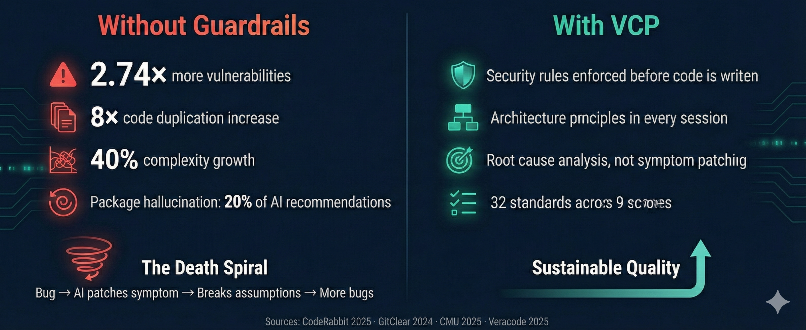
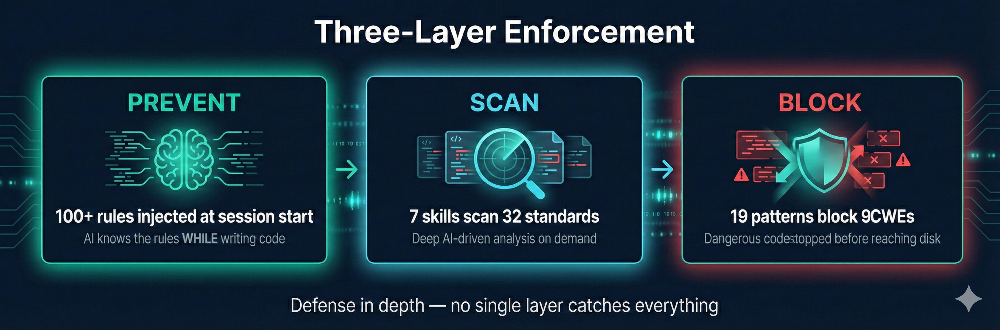

# VCP

**AI 生成代码的安全门控。**

VCP 跨 12 个作用域执行 41 项标准——在会话启动时将规则注入 AI 的上下文，实时拦截危险模式，并通过 10 个扫描 skill 提供按需深度分析。没有任何单一层能捕获所有问题，因此 VCP 将主动预防、按需扫描和实时拦截结合起来，实现纵深防御。

## 前置条件

- **[Bun](https://bun.sh/)** —— 跨平台 hook、skill helper 脚本和 VCP MCP server 所需。

## 组件

### Skill

| Skill | 命令 | 描述 |
|-------|------|------|
| vcp-init | `/vcp-init` | 初始化 VCP 配置——创建 `~/.vcp/config.json`（全局）和 `.vcp/config.json`（项目），检测框架、作用域，发现插件路径 |
| vcp-config | `/vcp-config` | 查看和更新 VCP 配置——作用域、合规、严重性、忽略规则、标准 URL |
| vcp-context | `/vcp-context` | 向上下文注入 VCP 规则摘要——在上下文压缩后或任何时候运行以刷新规则 |
| vcp-dependency-check | `/vcp-dependency-check` | 验证 lockfile 规范性、版本范围、包存在性、仿冒包检测 |
| vcp-pre-commit-review | `/vcp-pre-commit-review` | 对所有暂存/已修改文件进行标准审查。输出 PASS/BLOCK 结论 |
| vcp-audit | `/vcp-audit [path] \| compliance [framework] \| quick` | 全面审计，对比所有标准。支持完整审计、合规审计和发布就绪检查模式 |
| vcp-root-cause-check | `/vcp-root-cause-check [bug or path]` | 分析提议的 bug 修复——判断是否针对根因还是修补表象 |
| vcp-review-tests | `/vcp-review-tests [path]` | 审查测试质量的反模式：过度 mock、同义反复测试、缺失边界情况 |
| vcp-coverage-gaps | `/vcp-coverage-gaps [path]` | 将源文件映射到测试文件，识别未测试的函数和边界情况缺口 |
| vcp-test-plan | `/vcp-test-plan <path>` | 生成包含单元测试、集成测试、边界情况和 mock 指导的测试计划 |

扫描 skill 通过 Bash 调用 `resolve-config.ts` 来解析项目配置，并在运行时通过 WebFetch 获取标准。无需本地标准副本。

### Agent

| Agent | 描述 |
|-------|------|
| migration-planner | 对比所有 VCP 标准审计代码库，生成分阶段修复计划（安全 → 架构 → 质量 → 合规） |

### Hook

| Hook | 事件 | 触发条件 | 描述 |
|------|------|----------|------|
| security-context | SessionStart | 始终触发 | 会话启动时向 AI 上下文注入 VCP 规则摘要 |
| security-gate | PreToolUse | `Write\|Edit\|Bash` | 拦截包含危险代码模式的工具调用（CWE-798、CWE-89、CWE-95、CWE-79、CWE-502、CWE-643、CWE-1321、CWE-1336、CWE-116） |
| test-quality-warning | PostToolUse | `Write\|Edit` | 当测试文件包含 mock 滥用模式时发出警告（过度 mock、纯 mock 断言、同义反复断言） |
| stop-reminder | Stop | 始终触发 | 提醒用户在提交前运行 VCP 检查 |

## 工作原理

### 全局配置

VCP 在 `~/.vcp/config.json` 使用全局配置，存储所有项目共享的机器级设置：

- **`standards_url`** —— 标准清单 URL（默认：VCP 公开仓库；可指向内部 GitHub Enterprise）
- **`pluginRoot`** —— VCP 插件目录的绝对路径
- **`debug`** —— 启用诊断日志，输出到项目根目录的 `.vcp/vcp.log`（默认：`false`）
- **`defaults`** —— 可选默认值：`severity` 和 `ignore` 在运行时应用；`scopes` 和 `compliance` 仅在 `/vcp-init` 时作为起始建议

首次运行 `/vcp-init` 时创建。后续项目初始化复用已有全局配置。如果 skill 运行时全局配置缺失（例如在引入全局配置之前已存在的用户未重新运行 `/vcp-init`），将从项目配置和默认值自动创建。Hook 只读取全局配置——不会自动创建它（hook 在不受信任的仓库上下文中运行，必须保持快速）。

### 标准发现

Skill 调用 `resolve-config.ts`（通过 Bash）来解析项目配置和适用标准。脚本从全局配置（或项目级覆盖）解析标准 URL，获取清单，并为每项标准解析完整 URL。Skill 始终应用最新发布的规则。

URL 解析顺序：
1. `.vcp/config.json` 中的 `standards_url`（罕见的项目级覆盖）
2. `~/.vcp/config.json` 中的 `standards_url`（常规情况）

### 项目配置

Skill 需要 `.vcp/config.json`（项目）中包含 `pluginRoot` 字段（由 `/vcp-init` 设置）。如果缺少全局配置（`~/.vcp/config.json`），将自动创建（从项目配置 + 默认值），因此用户升级后无需重新运行 `/vcp-init`。项目配置决定：
- 适用的作用域（web-frontend、web-backend、database、mobile、desktop、cli、devops、agentic-ai）
- 激活的合规框架（GDPR、PCI DSS、HIPAA）
- 排除扫描的路径
- 报告的最低严重性阈值
- 忽略的标准或规则

运行时，`severity` 在项目未指定时回退到全局默认值，`ignore` 数组合并（全局 + 项目的并集）。`scopes` 和 `compliance` 是必需的项目字段——这些的全局默认值仅在 `/vcp-init` 时用作起始点，而非运行时。

如果找不到 `.vcp/config.json`，skill 会停止并提示用户运行 `/vcp-init`。

### 安全门控 Hook

`security-gate.ts` hook 在每次 `Write`、`Edit` 或 `Bash` 工具调用时运行。它从 stdin 解析工具输入 JSON，并对内容检查 9 类 CWE 的 21 个正则模式：

- **CWE-798** —— 硬编码秘密（密码、API 密钥）、AWS 访问密钥（AKIA/ASIA 等）、私钥（所有 PEM 格式）、JWT token、带嵌入凭证的数据库连接字符串、硬编码 Bearer token、Google/GitHub API 密钥前缀
- **CWE-89** —— 查询调用中的 SQL 字符串拼接和模板字面量注入，覆盖 Prisma（`$queryRawUnsafe`、`$executeRawUnsafe`）和 Knex（`whereRaw`、`havingRaw`、`orderByRaw`、`joinRaw`）
- **CWE-95** —— 用户控制输入的动态代码执行；Bash 中带动态输入的 shell 动态执行（仅 Bash）
- **CWE-79** —— `innerHTML` 赋值变量
- **CWE-502** —— 不安全的 Python 对象反序列化、无 Loader 的 `yaml.load`、`yaml.unsafe_load`/`full_load`、`node-serialize` 的 `.unserialize()`
- **CWE-643** —— `.xpath()` 调用中通过字符串拼接的 XPath 注入
- **CWE-1321** —— 通过 `__proto__` 或 `constructor.prototype` 赋值的原型污染
- **CWE-1336** —— 服务端模板注入（SSTI）：Jinja2 的 `Template()`/`.from_string()`、Handlebars 的 `.compile()` 带变量输入
- **CWE-116** —— 编码数据（base64/xxd）管道传输到 shell 执行或与 `sh -c` 组合（仅 Bash）

如果任何模式匹配，hook 退出码 2（拦截）并将发现打印到 stderr，由宿主作为工具错误展示。如果模式通过 CWE 忽略被抑制，hook 退出 0 并输出 JSON 警告到 stdout（在支持的宿主中通过 `systemMessage` 展示给用户）。否则退出 0（允许）。

### 诊断日志

所有 hook 通过共享的 `vcp-logger.ts` 模块将诊断条目写入项目根目录的 `.vcp/vcp.log`。日志记录每次调用的时间戳、hook 名称、决策和详情。请将 `.vcp/*.log` 添加到你的 `.gitignore`。

## 已知限制

- **标准从可变的 `main` 分支获取：** Skill 从 `https://raw.githubusercontent.com/.../main/...` 获取标准，这是可变的。强制推送或仓库被入侵可能改变所有用户收到的内容。当 VCP 达到 v1.0 时，标准将锚定到标记版本。对于 v0.6.0，在标准仍在编写期间，始终获取最新版本是有意的行为。

- **基于正则的安全门控无法进行污点追踪：** 安全门控 hook 使用正则模式匹配，无法跟踪数据流（例如在变量中构建的 SQL 查询然后传递给 `.query()`）。使用 `/vcp-audit` 或 `/vcp-pre-commit-review` skill 进行可以跨变量追踪数据流的 AI 驱动分析。

- **不常见技术的 Bash 混淆：** Bash 混淆检查捕获解码到执行的模式（管道传输到 shell、`sh -c` 加解码、`$SHELL`），但会遗漏不太常见的技术如 `python -c`、`perl -e`、变量间接引用或 `$'\x...'` 转义。AI skill 提供更深层的覆盖。

- **Prisma `$queryRaw` 标签模板有意不标记：** Prisma 的 `$queryRaw\`...\`` 使用标签模板字面量的语法是参数化的且安全的。只有带括号的 `$queryRawUnsafe()` 和 `$executeRawUnsafe()` 会被标记。

## 文档

完整文档请访问 **[VCP Wiki](https://github.com/Z-M-Huang/vcp/wiki)**：

- **[Getting Started](https://github.com/Z-M-Huang/vcp/wiki/Getting-Started.zh)** —— 安装、初始化、首次扫描
- **[Configuration](https://github.com/Z-M-Huang/vcp/wiki/Configuration.zh)** —— 作用域、合规、严重性、忽略规则
- **[Skills Reference](https://github.com/Z-M-Huang/vcp/wiki/Skills-Reference.zh)** —— 全部 10 个 skill 的用法和示例
- **[Three-Layer Enforcement Model](https://github.com/Z-M-Huang/vcp/wiki/Three%E2%80%90Layer-Enforcement-Model.zh)** —— 主动上下文、扫描和拦截如何协同工作
- **[Hooks Reference](https://github.com/Z-M-Huang/vcp/wiki/Hooks-Reference.zh)** —— 全部 4 个 hook 的触发条件和退出码
- **[Security Gate Patterns](https://github.com/Z-M-Huang/vcp/wiki/Security-Gate-Patterns.zh)** —— 全部 21 个正则模式，覆盖 9 类 CWE

## 安装

此插件是 [VCP](https://github.com/Z-M-Huang/vcp) 仓库的一部分。Claude Code 可通过 marketplace 安装（`/plugin install vcp@vcp`）；Codex CLI 可将仓库克隆到 `~/.codex/plugins/vcp`。Codex 读取 `.codex-plugin/plugin.json` 和 `.mcp.json`，Claude 读取 `.claude-plugin/plugin.json`。
